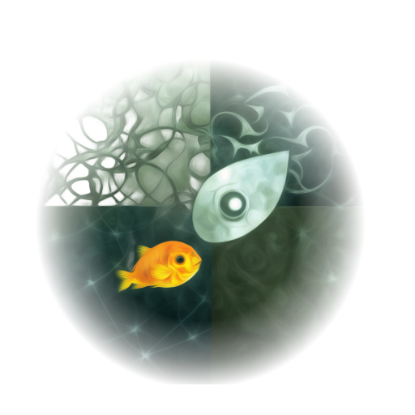

# FishBrain

    

Project: training small but powerful NNs on Stockfish data.

&nbsp;
&nbsp;

# FishBrain v1 - THE BIG REBOOT (YES!!!)
The goal of this project is to explore small NN architectures that excel at chess.
In contrast, <a href="https://github.com/official-stockfish/Stockfish">Stockfish</a> uses an NN architecture that sacrifices model capacity for extreme speed, while <a href="https://github.com/LeelaChessZero">Leela</a> uses a powerful but slow NN that is infeasible to train on consumer hardware.

&nbsp;
&nbsp;
With FishBrain, I explore the middle ground - fast NNs with no architectural sacrifices but small model size.
I believe this is a viable approach to create a competitive chess engine at home, once tree search is also implemented.
I hope to release a write-up about FishBrain's architecture and training soon.

# FishBrain v0
I finished the first NN (see v0_legacy) in 2024 and it works okay. The NN is much smaller than <a href="https://arxiv.org/html/2402.04494v1">DeepMind's</a> and achieves a Blitz Elo of about 1800. Some of the code is "research quality", sorry. Also there is no easy way to use it. I will make sure people can easily use the next FishBrain.

# Dataset
I am in the process of updating and reworking the dataset. It's going to be 2.5x bigger and a friendlier format.

&nbsp;
&nbsp;
Old dataset: <a href="https://huggingface.co/datasets/mauricett/lichess_sf">HuggingFace dataset</a>.
The data is extracted from the <a href="https://database.lichess.org/">lichess.org open database</a> and contains all games from 2023 for which Stockfish evaluations were available. It's easy to use with the HuggingFace dataloader, but I'm unhappy with the dependency on <a href="https://github.com/facebook/zstd">zstd</a>. It will be much better in the future.

# Future directions?
- Leela has produced <a href="https://storage.lczero.org/files/">enormous amounts of data</a> of very high quality. Ideally, I want to extract as much of this as I can into a *deduplicated* dataset of FEN positions.
- FishBrain should be an MoE, because it consumes little memory due to its small size. This means, we can scale it up to MoE virtually for free.
- Quantization: maybe FP4 for acceleration on Nvidia 50xx series?
- Pruning: train a very deep model and prune it in depth?
