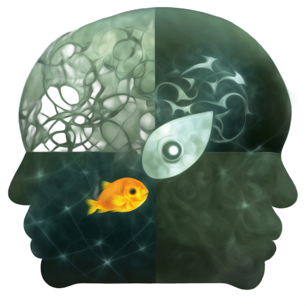
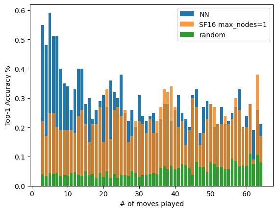

# FishBrain

    

&nbsp;
&nbsp;

FishBrain is a chess engine which uses a neural network trained on Stockfish evaluations.

&nbsp;
&nbsp;
# High-quality dataset soon
Currently, FishBrain streams training data directly from Lichess servers without saving big files on disk. However, this has proven to be too slow.
I'm now curating a dataset from all Lichess games that have been evaluated by Stockfish 16. Will be published soon.

# Technical reports soon
I will document my experiments and results in technical reports.

# First training run
I have begun a first training run and results are promising. My current way of measuring performance is to count how often FishBrain predicts SF16's top move.
For this, I created a special dataset which measures the performance for different amounts of half-moves.
You can see results in the following figure, where I compare the accuracy of FishBrain with SF16 (no tree search) and a random agent. We're already better than searchless SF16!

    

I'm heavily bottlenecked by the live-streamed DataLoader right now, but that problem is going to be solved soon.
